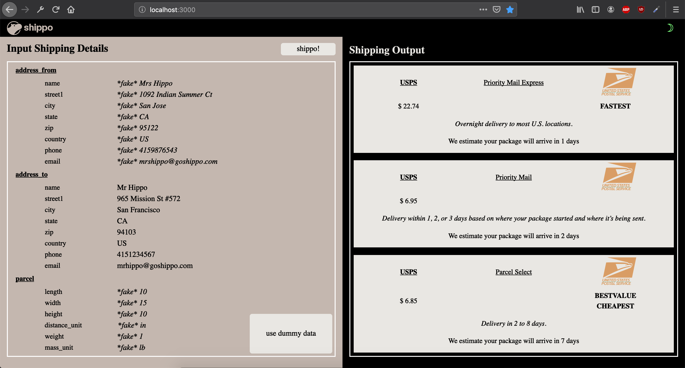
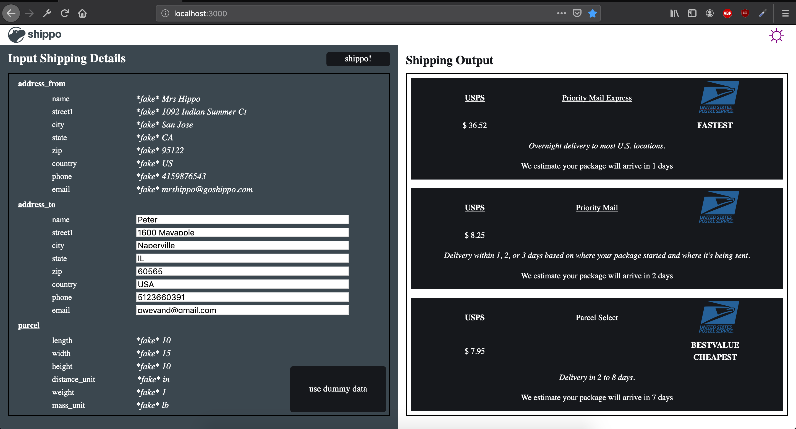
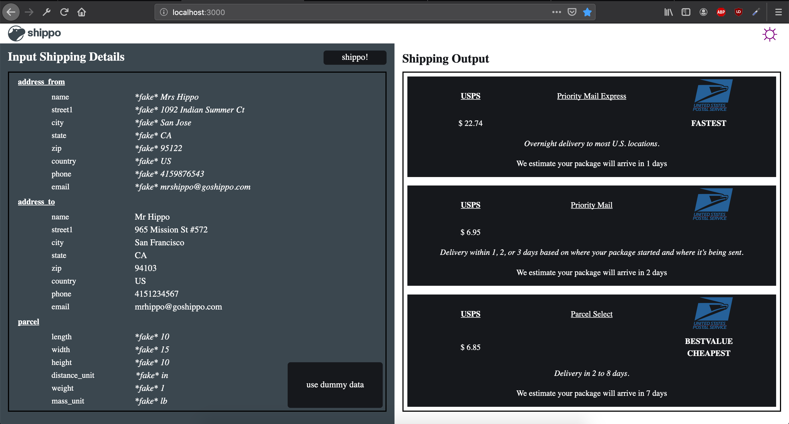

# Shippo Take Home Assignment;

## Motivation

This was just a take home assignment for a position I decided not to take. It has some good code organization and UI/UX, but it's nothing fancy.

## To run: 
`sudo chmod 777 run.sh && ./run.sh`

## Pics: 

